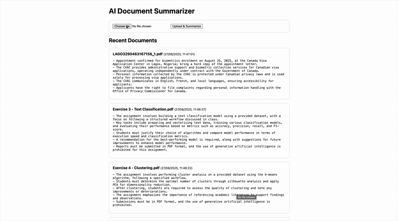

# AI Document Summarizer

A full-stack C#/.NET application that allows users to **upload documents** (`.txt`, `.pdf`, `.docx`), automatically generates an **AI-powered summary**, and stores both the original text and summary in a database.

This project demonstrates end-to-end skills in **ASP.NET Core development**, **Entity Framework Core**, **SQL Server**, **OpenAI API integration**, and **test-driven development**.



---

## Features

- Upload documents via a simple web UI.
- Extract text using:
  - [PdfPig](https://github.com/UglyToad/PdfPig) — PDF parsing.
  - [Xceed.Words.NET (DocX)](https://github.com/xceedsoftware/DocX) — Word parsing.
  - .NET built-in I/O — Text files.
- Summarizes documents into **5 concise bullet points** with OpenAI GPT.
- Persists original text + AI summary into SQL Server using EF Core.
- Minimal HTML/JavaScript UI served from `wwwroot/`.
- Modular architecture:
  - `Models/` — Entity classes
  - `Data/` — DbContext + EF migrations
  - `Services/` — AI service + text extractor
  - `wwwroot/` — Frontend

---

## Tech Stack

- **Backend**: ASP.NET Core 8 (Minimal API)  
- **Database**: SQL Server 2022 (Docker) + EF Core ORM  
- **Frontend**: Static HTML/JavaScript  
- **AI Integration**: OpenAI GPT Chat Completions API  
- **File Parsing**: PdfPig, DocX, System.IO  
- **Testing**:  
  - `xUnit` — unit and integration tests  
  - `EFCore.InMemory` — DB tests  
  - `MockHttp` — fake OpenAI API for AI service tests  
  - `WebApplicationFactory` — end-to-end API tests  

---

## Folder Structure

```text
AIDocSummarizer/
├── .gitignore
├── AIDocSummarizer/
│   ├── AIDocSummarizer.csproj
│   ├── Data/
│   │   └── AppDbContext.cs
│   ├── Migrations/
│   ├── Models/
│   │   └── Document.cs
│   ├── Program.cs
│   ├── Properties/
│   │   └── launchSettings.json
│   ├── appsettings.Development.json
│   ├── appsettings.json
│   ├── msbuild.binlog
│   ├── services/
│   │   ├── DocumentTextExtractor.cs
│   │   ├── IAiSummarizer.cs
│   │   └── OpenAiSummarizer.cs
│   └── wwwroot/
│       ├── index.css
│       ├── index.html
│       └── index.js
├── AIDocSummarizer.Tests/
│   ├── AIDocSummarizer.Tests.csproj
│   ├── AiSummarizerTests.cs
│   ├── DocumentTextExtractorTests.cs
│   ├── UploadEndpointTests.cs
├── AIDocSummarizer.sln
└── README.md
```

---

## Getting Started

### 1. Clone & restore

```bash
git clone https://github.com/yourusername/AIDocSummarizer.git
cd AIDocSummarizer
dotnet restore
```

---
### 2. Run SQL Server in Docker
```bash
docker run --name sqlserver -e "ACCEPT_EULA=Y" \
  -e "MSSQL_SA_PASSWORD=YourStrong!Passw0rd" \
  -p 1433:1433 -d mcr.microsoft.com/mssql/server:2022-latest
```

---
### 3. Configure connection string
Edit appsettings.json:

```json
"ConnectionStrings": {
  "Sql": "Server=localhost,1433;Database=AIDocSummarizerDb;User ID=sa;Password=YourStrong!Passw0rd;Encrypt=True;TrustServerCertificate=True"
}
```

---
### 4. Apply EF Core migrations
```bash
dotnet ef database update
```

---
### 5. Set OpenAi API key
```bash
export OPEN_API_KEY="sk-xxxx..."
```

---
### 6. Run app
```bash
dotnet run --project AIDocSummarizer
```

## Testing
Run all tests:

```bash
dotnet test
```